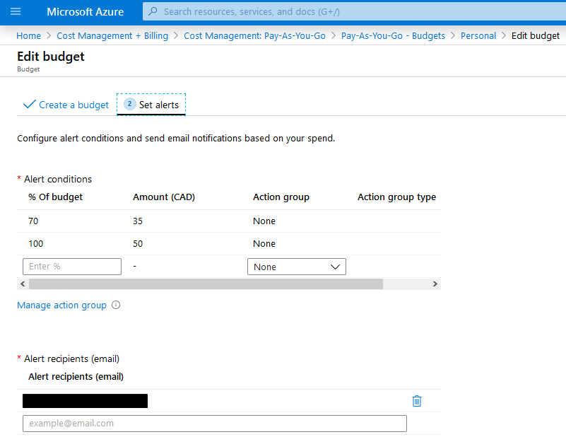

# Managing Azure Costs

A few tips and tricks for keeping Azure costs low as you experiment and learn about Azure. These recommendations are not meant for production environments, (although some might still be useful in a production environment) as I’m not giving much attention to performance. The recommendations apply best to development or study environments with intermittent usage.

## Subscription Options

Pay-as-you-go is likely your best option, unless you have a Visual Studio subscription or other avenues such as those available to students.

There are a number of Azure free trials, especially an initial [free account](https://azure.microsoft.com/en-ca/free/) with a number of credits you can use in the first 30 days and a collection of services you can use for free for up to a year. Beyond that initial free trial, you’ll find many subscriptions and features (e.g., Azure Premium) have 30-day trials, as well. Once you’ve used up your free trials you are then into strategically choosing and using resources in the most economical way.

Even if you work for a company that uses Azure and you could technically experiment within that environment, I recommend you use your own personal subscription. It’s not worth the risk of messing something up in your corporate environment, and you’ll feel a lot more freedom and comfort working in your own subscription.

## Budgets and cost alerts

Set budget alerts for your subscription. Unfortunately Microsoft does not let you set hard limits for pay-as-you-go subscriptions to automatically stop cost accumulation (you can see [here] (https://azure.microsoft.com/en-us/support/legal/offer-details/) for a list of subscription types that do support spending limits).

In my case I have a spending limit of $50, with two alerts set up that will go to my email address:

## Monitor and Analyze Costs

Monitor and analyze your costs regularly using Cost Management. The cost analysis graph gives you a quick view of your current and predicted costs, along with a breakdown by resource, location, and resource group. You’ll want to check it more frequently when you first start out until you get comfortable with Azure so that you can act on any costs that are accumulating faster than you anticipated. After a few weeks you can check less frequently and rely more on the alerts you have configured.

![cost mgmt] (azure-cost-mgmt.png)

## Recommended VM types

I recommend the “burstable” B series VMs for experimentation. They are designed to be cost effective in that they can lay idle for most of the time, then burst up to 100% capacity (and incur cost) when needed. They cost little while they lay idle and this is well-suited to using them for exploration and experimentation.

Standard_B1ms gives you 1 vCPU and 2G of RAM and gives you a lean option that can still let you run a server OS. Don’t expect performance, but its monthly cost is estimated to be around 20 USD and there are few options that cost less.

I’ll mention A-series as another affordable option if you have something in mind that requires more sustained resource usage but note that A-series VMs don’t support disk encryption. That ruled them out as an option for me as I’m primarily interested in cyber security.

Also note that not all VM types are available in all regions, so you may need to change your region to get access to some of the more affordable types. Most major regions will have them, but others do not (Canada East does not offer them, for example).

## Limiting available VM types

To avoid accidentally provisioning a beefy and expensive VM, configure a policy on your subscription to limit the available VM types. It may be unlikely that you’d choose a pricy VM, but this is simple to set up and ensures you keep to the VM types you can afford.

![vm policy] (azure-vm-policy.png)

## VM Auto Shutdown

Configure your VMs to turn off at a set time each night, so they’ll turn off even if you forget to shut them down.

![vm auto shutdown] (vm-auto-shutdown.png)

## Grouping Resources for Easy Deletion

Use resource groups to group together resources in cases where you are doing a more complex setup that involves several resources that you don’t need to keep long-term. For example, if you are exploring how to connect VNets you might configure several VNets, VMs, and other resources. Kubernetes is another area that requires several different resources and lends itself to grouping. Having them grouped together in a resource group specific to the experiment your running will let you keep them separate from other resources you want to keep longer term (e.g., key vaults or storage services). This way resources are easily deprovisioned when the experiment is over.

# Use HDD Storage

The Azure Portal will default to premium SSD – select standard HDD instead to save a bit of cost.

![hdd storage] (hdd-storage.png)

## Review Advisor Recommendations

Check your cost recommendations in Advisor from time-to-time, although if you are using Azure intermittently you may not find these recommendations that useful. My sense is that Advisor works best when it has a good amount of relatively stable usage data to work with, which is likely not the case in a development or learning environment.

![advisor] (azure-advisor.png)

## Things to Use Sparingly and Watch Closely

This is by no means an exhaustive list, but these are a few things I’ve noted that can add cost to your bill if they aren’t monitored closely. These are not necessarily expensive on a per-unit basis but might be billed continuously for the time they are configured and not based on resource usage.

### VPN gateways

These are billed “based on the amount of time that gateway is provisioned and available” (see [here] (https://azure.microsoft.com/en-us/pricing/details/vpn-gateway/) for the current pricing list). I did not read this carefully the first time and I assumed billing would be based on the amount of data I put through the gateway. The cheapest tier is estimated to cost 34 USD/month and so this can add up if you have it continuously available. I assume its creation and deletion can be scripted and this can help limit costs, but I haven’t got around to trying this.

### Storage

As you probably expect, storage is billed based on the amount of data you keep. If you set up automatic storage of audit log data, you can find your data volume creep up along with the associated costs. Periodically cleaning out log data (or whatever data) that you no longer need will help keep these costs down.

### Load Balancers

Basic load balancers in Azure are free but standard load balancers are not and have charges that include per-hour per-rule charges that you will incur regardless of how much data flows through the load balancer. The costs are modest if you have a couple of load balancer rules and minimal data flowing through it, but you should be aware that the per-rule costs keep adding up even when you are not using it.

If you are setting up a Kubernetes cluster using the Azure Portal, you are only given the option for a standard load balancer. You can set up a cluster using a basic load balancer via CLI, but you must read a bit of fine print to be aware of this.

