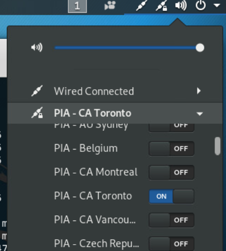

# Installing private internet access on Kali

Version:
Linux kali 4.19.0-kali4-686-pae #1 SMP Debian 4.19.28-2kali1 (2019-03-18) i686 GNU/Linux

* wget https://www.privateinternetaccess.com/installer/pia-nm.sh

* sudo bash pia-nm.sh
  * choose UDP for connectiont type, and strong encryption

* turn on VPN



my routing table at this point:
```
chris@kali:~$ route
Kernel IP routing table
Destination     Gateway         Genmask         Flags Metric Ref    Use Iface
default         _gateway        0.0.0.0         UG    0      0        0 eth0
default         _gateway        0.0.0.0         UG    50     0        0 tun0
10.81.10.1      _gateway        255.255.255.255 UGH   50     0        0 tun0
_gateway        0.0.0.0         255.255.255.255 UH    50     0        0 tun0
172.98.67.62    _gateway        255.255.255.255 UGH   100    0        0 eth0
192.168.1.0     0.0.0.0         255.255.255.0   U     0      0        0 eth0
192.168.1.0     0.0.0.0         255.255.255.0   U     100    0        0 eth0
_gateway        0.0.0.0         255.255.255.255 UH    100    0        0 eth0
```

* traffic was still going through my ISP IP, so I deleted the default route through eth0
```
sudo route del default dev eth0
```

* re-check your IP location through a browser, e.g. usinig iplocation.net

* I also had another local subnet (192.168.2.0/24) so I added another route:
```
sudo route add -net 192.168.2.0 netmask 255.255.255.0 gw 192.168.1.1
```

